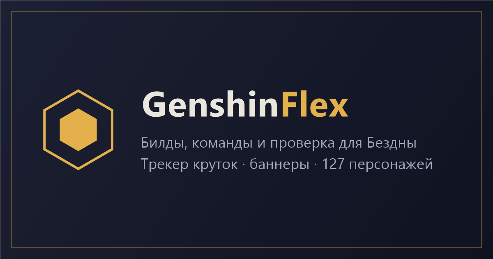
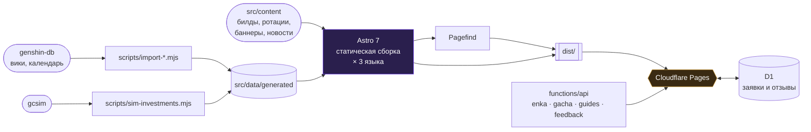

<div align="center">



# GenshinFlex

**Открытый справочник по Genshin Impact для текущей ротации: билды, команды, эндгейм и трекер круток на одном сайте. Рекламы нет.**

[](https://genshinflex.com)
[](https://astro.build)
[](https://pages.cloudflare.com)
[](#-три-языка)
[](LICENSE)

[Возможности](#-возможности) · [Быстрый старт](#-быстрый-старт) · [Как устроено](#-как-устроено) · [Контент](#-как-добавлять-контент) · [Roadmap](#-roadmap)

</div>

---

## 📌 Проблема

> Вышел новый цикл Бездны, и чтобы собрать под него две команды, приходится открыть пять вкладок.

- **Информация разбросана.** Билд на одном сайте, команды на другом, враги текущего цикла на вики, таймер до сброса в голове.
- **Тир-листы устаревают.** Одна буква на всё: без учёта режима, цикла и твоего аккаунта.
- **Реклама и пейволлы.** Гайд прочитать можно, но только после трёх баннеров и всплывающего окна.
- **Свой аккаунт не учитывается.** Советуют персонажей, которых у тебя нет, и оружие, которое ты не выбьешь.

## 💡 Решение

GenshinFlex собирает всё про текущий патч в одном месте и подстраивается под твой аккаунт.

| | Обычно | В GenshinFlex |
|---|---|---|
| Билд персонажа | отдельный сайт, часто устаревший | оружие, артефакты, статы, таланты и команды на одной странице |
| Бездна / Театр / Натиск | вики + таймер в голове | враги, баффы и команды текущего цикла, таймер по серверу |
| «Какие команды собрать?» | подбирать самому | проверка команды: персонажи по UID, вердикт с объяснениями |
| «Стоит ли выбивать C1 / сигнатурку?» | споры в комментариях | прирост урона команды по симуляциям gcsim |
| История круток | таблицы вручную | импорт по ссылке из игры или файлу UIGF, гарант и 50/50 считаются сами |

## ✨ Возможности

- 🧙 **Все 127 персонажей.** Статы на любом уровне, множители талантов, созвездия, билды и команды. 26 разборов написаны вручную, остальные собраны из открытых данных.
- 🏰 **Эндгейм по страницам.** Витая бездна 9–12, Театр воображариума и Натиск: враги, баффы и команды для текущего цикла.
- 🛡 **Проверка команды для Бездны.** Персонажи добавляются вручную или по UID через enka.network. Для каждой половины подбирается команда, вердикт идёт с объяснениями.
- 📈 **«Стоит ли выбивать».** Показывает, насколько вырастет урон всей команды от созвездий C0–C6 и лучшего 5★ оружия. Цифры взяты из прогонов [gcsim](https://gcsim.app).
- 🎰 **Трекер круток.** Импорт по ссылке из игры (есть PowerShell-скрипт) или файлом UIGF. Показывает гарант 5★/4★, исход 50/50 и потраченные примогемы. **Данные остаются только в браузере.**
- 🔁 **Конструктор ротаций.** Команда, оружие, сеты и порядок действий. Всё состояние хранится в ссылке, поэтому ротацией можно поделиться без регистрации.
- 🧮 **Калькулятор прокачки.** Материалы, книги опыта и мора для персонажа, талантов и оружия. Расчётом можно поделиться ссылкой.
- 🗓 **Баннеры и календарь** с таймерами по времени выбранного сервера (Европа / Америка / Азия).
- ✍️ **Гайды сообщества.** Редактор гайдов на трёх языках. Заявки попадают в очередь модерации и не публикуются сами.
- 🔎 **Поиск.** Мгновенный по названиям и полнотекстовый по гайдам на [Pagefind](https://pagefind.app).

## ⚡ Быстрый старт

Нужен Node.js 22.12+.

```bash
git clone https://github.com/logreus-cloud/genshinflex
cd genshinflex
npm install
npm run dev          # http://localhost:4321
```

`npm run dev` запускает только фронтенд. Поиск и `/api/*` в нём не работают. Чтобы проверить сайт целиком, как в продакшене:

```bash
npm run dev:full     # сборка + локальный Cloudflare Pages с функциями и D1
```

<details>
<summary><b>Все команды</b></summary>

| Команда | Что делает |
|---|---|
| `npm run dev` | dev-сервер Astro |
| `npm run build` | сборка в `dist/` + индекс Pagefind |
| `npm run dev:full` | сборка + `wrangler pages dev`: поиск и серверные функции |
| `npm run import` | обновить игровые данные в `src/data/generated` (genshin-db, враги, баннеры, прокачка, источники оружия, календарь) |
| `npm run sim -- [слаги…]` | пересчитать «Стоит ли выбивать» через gcsim (нужен `.cache/gcsim.exe`) |
| `npm run guides` | заявки гайдов из D1 |
| `npm run guide:md <id>` | превратить одобренную заявку в файл билда |
| `npm run feedback` | последние сообщения обратной связи |
| `npm run deploy` | сборка и выкладка на Cloudflare Pages (нужен `wrangler login`) |

</details>

## 🏗 Как устроено



Сайт почти полностью статический. Серверные функции Cloudflare Pages (`functions/api/`) есть только там, где без них не обойтись:

| Эндпоинт | Зачем |
|---|---|
| `/api/enka/[uid]` | прокси к enka.network для импорта витрины по UID: API не отдаёт данные браузеру напрямую |
| `/api/gacha` | прокси к истории молитв HoYoverse по той же причине |
| `/api/guides` | приём гайдов из редактора: валидация, лимит заявок, запись в очередь D1 |
| `/api/feedback` | форма обратной связи → D1 |
| `/api/admin/*` | админка за Cloudflare Access; функция дополнительно проверяет подпись токена и почту |

<details>
<summary><b>Почему так</b></summary>

- **Билды — это Markdown со схемой.** Слаги персонажей, оружия и артефактов проверяются по сгенерированным данным, поэтому опечатка роняет сборку и не попадает на сайт.
- **Игровые данные генерируются, а не пишутся руками.** Статы, множители и материалы берутся из genshin-db одной командой при выходе патча, так что ручных ошибок в цифрах нет.
- **Трекер круток ничего не хранит на сервере.** Ссылка с authkey проходит через прокси и никуда не сохраняется, история лежит в `localStorage`.
- **Состояние конструктора ротаций живёт в URL.** Не нужны ни аккаунты, ни база: ссылка и есть сохранение.
- **Гайды сообщества проходят модерацию.** Из формы ничего не попадает на сайт напрямую: одобренная заявка превращается в обычный файл билда и проходит ту же проверку схемой.

</details>

### 🌍 Три языка

Русская версия лежит в корне, английская и испанская — в `/en/` и `/es/`. Страницы находятся в `src/pages/[...locale]/`.

- Ключ перевода — сама русская строка: `t('Проверка команды')`. Поэтому код читается без словаря.
- Словари интерфейса (`src/i18n/ui.{en,es}.json`) и контента (`content.{en,es}.json`) собираются скриптами из `scripts/i18n/`. Они же проверяют, что у каждого ключа из кода есть перевод и что плейсхолдеры совпадают.
- Непереведённые строки после сборки попадают в `.i18n-missing.json`.
- Тексты разборов на других языках лежат в `src/content/builds-i18n/{en,es}/`.

## 📝 Как добавлять контент

| Что | Где | Подробно |
|---|---|---|
| Билд персонажа | `src/content/builds/<слаг>.md` | [CONTRIBUTING.md](CONTRIBUTING.md#как-добавить-билд) |
| Ротация эндгейма | `src/content/rotations/<режим>-current.json` | [CONTRIBUTING.md](CONTRIBUTING.md#как-обновить-ротацию) |
| Баннер | `src/content/banners/<патч>-<фаза>.json` | по образцу существующих |
| Новость | `src/content/news/{ru,en,es}/` | [CONTRIBUTING.md](CONTRIBUTING.md#как-опубликовать-новость-сайта) |

Главное правило: **пиши своими словами.** Тексты с других сайтов не копируются. Если опирался на чужой гайд, укажи его в `sources`.

Известные, но ещё не исправленные баги перечислены в [KNOWN_ISSUES.md](KNOWN_ISSUES.md).

## 🗺 Roadmap

- [x] База персонажей, оружия и артефактов из открытых данных
- [x] Билды для всех персонажей, эндгейм текущего цикла
- [x] Проверка команды, трекер круток, конструктор ротаций, калькулятор
- [x] Русская, английская и испанская версии
- [x] Гайды сообщества с модерацией
- [ ] **Рейтинг сообщества.** Попарное голосование вместо тир-листа, Glicko-2 с видимой погрешностью «±»
- [ ] **Рейтинг по забегам.** Сабмиты «команда + время» отдельно по каждому режиму и циклу
- [ ] ИИ-помощник, который отвечает со ссылками на страницы сайта

## 📄 Лицензия

Код распространяется по [MIT](LICENSE), тексты руководств — по [CC BY-SA 4.0](https://creativecommons.org/licenses/by-sa/4.0/).

Игровые данные: [genshin-db](https://github.com/theBowja/genshin-db). Изображения: enka.network и HoYoLAB. Симуляции: [gcsim](https://github.com/genshinsim/gcsim), используются только результаты прогонов.

Genshin Impact, игровые изображения и данные © HoYoverse. Проект неофициальный и с HoYoverse не связан.
