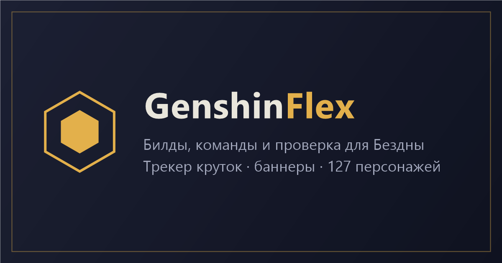
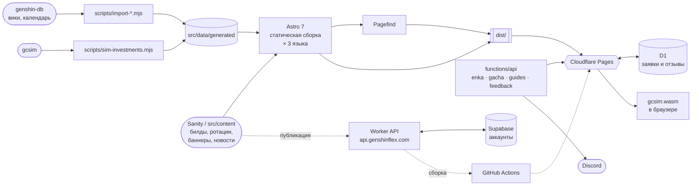

<div align="center">



# GenshinFlex

Справочник по Genshin Impact под текущую ротацию: билды, команды, эндгейм, симулятор и трекер круток. Без рекламы, код открыт.

[genshinflex.com](https://genshinflex.com) · [Discord](https://discord.gg/rQ6pTDqdX9) · [Telegram](https://t.me/genshinflex)


</div>

## Зачем

С выходом нового цикла Бездны обычно приходится держать открытыми несколько сайтов: билд в одном месте, команды в другом, враги на вики. Тир-листы при этом не знают, какие персонажи есть у тебя. GenshinFlex собирает это на одном сайте и умеет подтягивать твой аккаунт по UID.

## Что есть на сайте

**Персонажи, оружие, артефакты.** Статы на любом уровне, множители талантов, созвездия, билды и команды. Разборы частично написаны вручную, частично собраны из открытых данных. Персонажи из утечек помечены BETA. У оружия и сетов карточки раскрываются по наведению: статы на 90 уровне, пассивка, бонусы и кто их носит.

**Эндгейм текущего цикла.** Витая бездна 9–12: враги по залам и половинам, аномалии, команды. Театр воображариума и Натиск: сложности, акты и бои, механики боссов, советы и команды на каждый этап, видеогайды.

**Проверка команды для Бездны.** Персонажи вводятся вручную или по UID через enka.network. На каждую половину подбирается команда, к вердикту прилагается объяснение.

**Симулятор.** Персонажи, оружие и артефакты берутся из витрины по UID, команда прогоняется через [gcsim](https://gcsim.app) прямо в браузере (WebAssembly в Web Worker), на сервер ничего не отправляется. На тех же прогонах построен раздел «Стоит ли выбивать»: насколько вырастет урон команды от C1–C6 и лучшего 5★ оружия.

**Трекер круток.** Импорт по ссылке из игры (для этого есть PowerShell-скрипт) или файлом UIGF. Считает гарант 5★/4★, исход 50/50 и потраченные примогемы. Без аккаунта история хранится в браузере, с аккаунтом синхронизируется.

**Профиль.** «Мои персонажи», избранное, UID и оформление синхронизируются между устройствами, профиль можно выгрузить в файл. У каждого аккаунта есть публичная страница `genshinflex.com/u/ник` с обложкой, аватаром, титулом и любимыми персонажами. Что из этого видно другим, настраивается во вкладке «Приватность»; по умолчанию UID, персонажи, избранное и крутки скрыты.

**Инструменты.** Конструктор ротаций (всё состояние в ссылке, регистрация не нужна), калькулятор прокачки, баннеры и календарь с таймерами по серверу, поиск на [Pagefind](https://pagefind.app).

**Сообщество.** Гайды можно писать в редакторе на сайте на трёх языках, они проходят модерацию. На [Discord-сервере](https://discord.gg/rQ6pTDqdX9) есть форумы для багов и идей, туда же бот присылает новости сайта и напоминания о сбросе Бездны, баннерах и ивентах. Анонсы обновлений выходят в [Telegram](https://t.me/genshinflex).

## Запуск

Нужен Node.js 22.12 или новее.

```bash
git clone https://github.com/logreus-cloud/genshinflex
cd genshinflex
npm install
npm run dev          # http://localhost:4321
```

`npm run dev` поднимает только фронтенд, поиск и `/api/*` в нём не работают. Чтобы проверить сайт целиком, как в продакшене:

```bash
npm run dev:full     # сборка + локальный Cloudflare Pages с функциями и D1
```

<details>
<summary>Остальные команды</summary>

| Команда | Что делает |
|---|---|
| `npm run dev` | dev-сервер Astro |
| `npm run build` | сборка в `dist/` и индекс Pagefind |
| `npm run dev:full` | сборка и `wrangler pages dev`: поиск и серверные функции |
| `npm run import` | обновить игровые данные в `src/data/generated` (genshin-db, враги, баннеры, прокачка, источники оружия, календарь) |
| `npm run sim -- [слаги…]` | пересчитать «Стоит ли выбивать» через gcsim (нужен `.cache/gcsim.exe`) |
| `npm run sim:presets` | эталонные команды для симулятора в браузере |
| `npm run guides` | заявки гайдов из D1 |
| `npm run guide:md <id>` | превратить одобренную заявку в билд |
| `npm run feedback` | последние сообщения обратной связи |
| `npm test` | тесты: контракт схем zod и Sanity, перенос контента, API, пользовательские данные, переводы, проверка команды |
| `npm run cms:push -- <файлы>` | выгрузить изменённые файлы из `src/content` в Sanity (`--dry` только покажет) |
| `npm run deploy` | сборка из Sanity и выкладка на Cloudflare Pages (нужны `wrangler login` и `SANITY_READ_TOKEN` в `.env`); новые новости уходят в Discord |
| `npm run deploy:test` | сборка из файлов и выкладка на test.genshinflex.pages.dev |

</details>

## Устройство


```mermaid
flowchart LR
    GDB([genshin-db<br/>вики, календарь]) --> IMP[scripts/import-*.mjs]
    IMP --> GEN[(src/data/generated)]
    SIM([gcsim]) --> INV[scripts/sim-investments.mjs] --> GEN
    CMS([Sanity / src/content<br/>билды, ротации,<br/>баннеры, новости]) --> ASTRO
    GEN --> ASTRO[Astro 7<br/>статическая сборка<br/>× 3 языка]
    ASTRO --> PF[Pagefind] --> DIST[[dist/]]
    ASTRO --> DIST
    DIST --> CF{{Cloudflare Pages}}
    FN[functions/api<br/>enka · gacha · guides · feedback] --> CF
    CF <--> D1[(D1<br/>заявки и отзывы)]
    FN --> DC([Discord])
    CF --> WASM[gcsim.wasm<br/>в браузере]
    API[Worker API<br/>api.genshinflex.com] <--> SB[(Supabase<br/>аккаунты)]
    CMS -. публикация .-> API -. сборка .-> GHA[GitHub Actions] -.-> CF
```

Сайт почти целиком статический. Серверные функции Cloudflare Pages (`functions/api/`) есть только там, где без них нельзя:

| Эндпоинт | Зачем |
|---|---|
| `/api/enka/[uid]` | прокси к enka.network для импорта витрины: их API не отдаёт данные браузеру напрямую |
| `/api/gacha` | прокси к истории молитв HoYoverse по той же причине |
| `/api/guides` | приём гайдов из редактора: валидация, лимит заявок, очередь в D1, уведомление в Discord |
| `/api/feedback` | обратная связь в D1 и Discord |
| `/api/admin/*` | админка за Cloudflare Access; функция дополнительно проверяет подпись токена и почту |
| `/u/<ник>` (middleware) | статическая страница профиля с именем игрока в title и og; неизвестный или скрытый профиль отдаёт 404 |

Ещё есть Worker `workers/discord-reminders`: раз в час читает `/data/reminders.json` и пишет в Discord о сбросах эндгейма, баннерах и ивентах.

<details>
<summary>Почему так</summary>

- Билды хранятся как данные со схемой. Слаги персонажей, оружия и артефактов сверяются со сгенерированными данными, так что опечатка роняет сборку, а не попадает на сайт.
- Игровые цифры не пишутся руками: статы, множители и материалы при выходе патча берутся из genshin-db одной командой.
- Симулятор считает на стороне пользователя. Сервер не нагружается, а UID и билды никуда не уходят, кроме запроса витрины к enka.network.
- Ссылка на историю круток не сохраняется: authkey проходит через прокси и забывается. Сама история без аккаунта лежит в браузере, с аккаунтом в Supabase под RLS, где её видит только владелец.
- Сайт использует ClientRouter Astro. У каждой сборки есть метка, и если сайт обновился, пока вкладка открыта, следующий переход перезагружает страницу целиком, чтобы не остались старые скрипты.
- Конструктор ротаций хранит состояние в URL, поэтому ему не нужны ни аккаунт, ни база.
- Гайды сообщества не попадают на сайт напрямую: одобренная заявка превращается в обычный билд и проходит ту же проверку схемой.

</details>

### Языки

Русская версия лежит в корне, английская и испанская в `/en/` и `/es/`. Страницы находятся в `src/pages/[...locale]/`.

Ключ перевода сама русская строка, например `t('Проверка команды')`, так что код читается без словаря. Строки интерфейса собраны в `src/i18n/ui.json` в виде `"русская строка": { "en": "…", "es": "…" }`, переводы контента лежат в `src/i18n/content.manual.json` и `content-auto.json`, тексты разборов в `src/content/builds-i18n/{en,es}/`.

`npm run test:i18n` проверяет, что у каждого ключа есть перевод и плейсхолдеры совпадают. В CI сборка падает на непереведённых строках интерфейса (`I18N_STRICT=1`), локально они складываются в `.i18n-missing.json`.

## Аккаунты и CMS

Регистрация на сайте необязательна, аккаунт нужен только для синхронизации данных между устройствами. Схема данных и настройка сервисов описаны в [`docs/architecture.md`](docs/architecture.md).

| Часть | Сервис | Что делает |
|---|---|---|
| Аккаунты | [Supabase](https://supabase.com) (Postgres + Auth, ЕС) | вход по почте, через Discord, Google и Telegram; письма через Resend; доступ к данным ограничен RLS |
| API | Cloudflare Worker на [Hono](https://hono.dev), `api.genshinflex.com` | проверка токена, вход через Telegram, выгрузка и удаление аккаунта, вебхук CMS |
| Контент | [Sanity](https://www.sanity.io) | билды, ротации, баннеры, новости и гайды редактируются в браузере |
| Автосборка | Sanity → Worker → GitHub Actions → Pages | после публикации в Studio сайт пересобирается за 2–3 минуты |

Форма контента выводится из схем Sanity (`packages/content-model`), а контрактный тест сверяет её со схемами zod сайта: если поле добавлено только с одной стороны, тесты падают. Скрипты ставят в документ отметку содержимого, и если документ уже правили в Studio, `cms:push` не перезапишет его без `--force`.

Пользователь может выгрузить все свои данные одной кнопкой или удалить аккаунт (только после недавнего входа). Политика конфиденциальности есть на всех трёх языках.

## Контент

| Что | Где | Подробно |
|---|---|---|
| Билд персонажа | `src/content/builds/<слаг>.md` | [CONTRIBUTING.md](CONTRIBUTING.md#как-добавить-билд) |
| Ротация эндгейма | `src/content/rotations/<режим>-current.json` | [CONTRIBUTING.md](CONTRIBUTING.md#как-обновить-ротацию) |
| Баннер | `src/content/banners/<патч>-<фаза>.json` | по образцу существующих |
| Новость | `src/content/news/{ru,en,es}/` | [CONTRIBUTING.md](CONTRIBUTING.md#как-опубликовать-новость-сайта) |

Основной источник контента сейчас Sanity Studio. Файлы в `src/content` остаются резервной копией и форматом для скриптов (`npm run cms:export`, `npm run cms:push`).

Тексты пишутся своими словами, копировать с других сайтов нельзя. Если опирался на чужой гайд, укажи его в `sources`.

Баги и задачи в [GitHub Issues](https://github.com/logreus-cloud/genshinflex/issues), известные ограничения в [KNOWN_ISSUES.md](KNOWN_ISSUES.md).

## Планы

Уже сделано: база персонажей и билды, эндгейм, проверка команды, симулятор, трекер круток, три языка, гайды сообщества, Discord, аккаунты с CMS, публичные профили.

Дальше:

- симулятор для персонажей, которых ещё нет в gcsim (Сандроне, Весна, Водяница и другие);
- рейтинг сообщества: попарное голосование вместо тир-листа, Glicko-2 с видимой погрешностью;
- рейтинг по забегам: команда и время отдельно по каждому режиму и циклу;
- ИИ-помощник, который отвечает со ссылками на страницы сайта;
- оверлей поверх игры: открываешь персонажа и сразу видишь его билд, по горячей клавише.

## Лицензия

Код GenshinFlex распространяется по [MIT](LICENSE), тексты руководств по [CC BY-SA 4.0](https://creativecommons.org/licenses/by-sa/4.0/).

Движок симулятора gcsim (`public/gcsim/gcsim.wasm.gz`) принадлежит The gcsim contributors и распространяется по [AGPL-3.0](public/gcsim/LICENSE). Он собран из [gcsim v2.48.8](https://github.com/genshinsim/gcsim/tree/1f9c1f2e9698239a24b44e38a21358a00fd16bff) без изменений; исходник, команда сборки и контрольные суммы лежат в [`public/gcsim/NOTICE.md`](public/gcsim/NOTICE.md). Если выкладываете форк с этим движком, условия AGPL распространяются и на него.

Остальные сторонние компоненты перечислены в [THIRD_PARTY_NOTICES.md](THIRD_PARTY_NOTICES.md). Игровые данные из [genshin-db](https://github.com/theBowja/genshin-db), изображения с enka.network и HoYoLAB.

Genshin Impact, игровые изображения и данные принадлежат HoYoverse. Проект неофициальный и с HoYoverse не связан.
