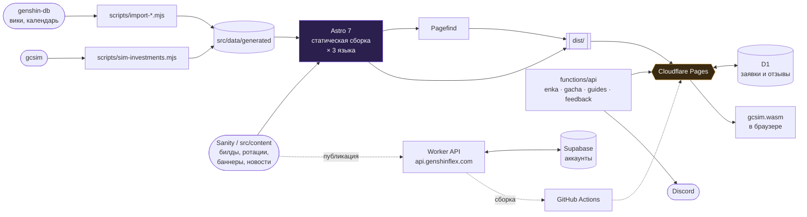

<div align="center">


# GenshinFlex

**Открытый справочник по Genshin Impact для текущей ротации: билды, команды, эндгейм, симулятор команды и трекер круток на одном сайте. Рекламы нет.**

[](https://genshinflex.com)
[](https://discord.gg/rQ6pTDqdX9)
[](https://t.me/genshinflex)
<br>
[](https://astro.build)
[](https://pages.cloudflare.com)
[](#-три-языка)
[](#-лицензия)

[Возможности](#-возможности) · [Быстрый старт](#-быстрый-старт) · [Как устроено](#-как-устроено) · [Аккаунты и CMS](#-аккаунты-и-cms) · [Контент](#-как-добавлять-контент) · [Roadmap](#-roadmap) · [Лицензия](#-лицензия)

</div>

---

## 📌 Проблема

> Вышел новый цикл Бездны, и чтобы собрать под него две команды, приходится открыть пять вкладок.

- **Информация разбросана.** Билд на одном сайте, команды на другом, враги текущего цикла на вики, таймер до сброса в голове.
- **Тир-листы устаревают.** Одна буква на всё: без учёта режима, цикла и твоего аккаунта.
- **Реклама и пейволлы.** Гайд прочитать можно, но только после трёх баннеров и всплывающего окна.
- **Свой аккаунт не учитывается.** Советуют персонажей, которых у тебя нет, и оружие, которое ты не выбьешь.

## 💡 Решение

GenshinFlex собирает всё про текущий патч в одном месте и подстраивается под твой аккаунт.

| | Обычно | В GenshinFlex |
|---|---|---|
| Билд персонажа | отдельный сайт, часто устаревший | оружие, артефакты, статы, таланты и команды на одной странице |
| Бездна / Театр / Натиск | вики + таймер в голове | враги, баффы и команды текущего цикла, таймер по серверу |
| «Какие команды собрать?» | подбирать самому | проверка команды: персонажи по UID, вердикт с объяснениями |
| «Сколько урона выдаст моя команда?» | считать в таблицах | симулятор: твои персонажи из витрины по UID, прогон gcsim прямо в браузере |
| «Стоит ли выбивать C1 / сигнатурку?» | споры в комментариях | прирост урона команды по симуляциям gcsim |
| История круток | таблицы вручную | импорт по ссылке из игры или файлу UIGF, гарант и 50/50 считаются сами |

## ✨ Возможности

- 🧙 **Все персонажи.** Статы на любом уровне, множители талантов, созвездия, билды и команды. Разборы написаны вручную или собраны из открытых данных; персонажи из утечек помечены BETA.
- 🏰 **Эндгейм по страницам.** Витая бездна 9–12, Театр воображариума и Натиск: враги, баффы и команды для текущего цикла.
- 🛡 **Проверка команды для Бездны.** Персонажи добавляются вручную или по UID через enka.network. Для каждой половины подбирается команда, вердикт идёт с объяснениями.
- 🧪 **Симулятор команды.** Персонажи, оружие и артефакты подтягиваются из витрины по UID, команда прогоняется движком [gcsim](https://gcsim.app) **в браузере** (WebAssembly в Web Worker): на сервер ничего не уходит.
- 📈 **«Стоит ли выбивать».** Показывает, насколько вырастет урон всей команды от созвездий C0–C6 и лучшего 5★ оружия — по прогонам gcsim.
- 🎰 **Трекер круток.** Импорт по ссылке из игры (есть PowerShell-скрипт) или файлом UIGF. Показывает гарант 5★/4★, исход 50/50 и потраченные примогемы. **Данные остаются только в браузере.**
- 🔁 **Конструктор ротаций.** Команда, оружие, сеты и порядок действий. Всё состояние хранится в ссылке, поэтому ротацией можно поделиться без регистрации.
- 🧮 **Калькулятор прокачки.** Материалы, книги опыта и мора для персонажа, талантов и оружия. Расчётом можно поделиться ссылкой.
- 🗓 **Баннеры и календарь** с таймерами по времени выбранного сервера (Европа / Америка / Азия).
- ✍️ **Гайды сообщества.** Редактор гайдов на трёх языках. Заявки попадают в очередь модерации и не публикуются сами.
- 💬 **Сообщество.** [Discord-сервер](https://discord.gg/rQ6pTDqdX9): отзывы и заявки с сайта приходят в каналы команды, баги и идеи — в публичные форумы, новости сайта публикуются сами, бот напоминает о сбросе Бездны, баннерах и ивентах. Анонсы обновлений — в [Telegram-канале](https://t.me/genshinflex).
- 🔎 **Поиск.** Мгновенный по названиям и полнотекстовый по гайдам на [Pagefind](https://pagefind.app).

## ⚡ Быстрый старт

Нужен Node.js 22.12+.

```bash
git clone https://github.com/logreus-cloud/genshinflex
cd genshinflex
npm install
npm run dev          # http://localhost:4321
```

`npm run dev` запускает только фронтенд. Поиск и `/api/*` в нём не работают. Чтобы проверить сайт целиком, как в продакшене:

```bash
npm run dev:full     # сборка + локальный Cloudflare Pages с функциями и D1
```

<details>
<summary><b>Все команды</b></summary>

| Команда | Что делает |
|---|---|
| `npm run dev` | dev-сервер Astro |
| `npm run build` | сборка в `dist/` + индекс Pagefind |
| `npm run dev:full` | сборка + `wrangler pages dev`: поиск и серверные функции |
| `npm run import` | обновить игровые данные в `src/data/generated` (genshin-db, враги, баннеры, прокачка, источники оружия, календарь) |
| `npm run sim -- [слаги…]` | пересчитать «Стоит ли выбивать» через gcsim (нужен `.cache/gcsim.exe`) |
| `npm run sim:presets` | эталонные команды для симулятора в браузере |
| `npm run guides` | заявки гайдов из D1 |
| `npm run guide:md <id>` | превратить одобренную заявку в билд |
| `npm run feedback` | последние сообщения обратной связи |
| `npm run deploy` | сборка и выкладка на Cloudflare Pages (нужен `wrangler login`); новые новости уходят в Discord |
| `npm run deploy:test` | то же на тестовый адрес test.genshinflex.pages.dev |

</details>

## 🏗 Как устроено


```mermaid
flowchart LR
    GDB([genshin-db<br/>вики, календарь]) --> IMP[scripts/import-*.mjs]
    IMP --> GEN[(src/data/generated)]
    SIM([gcsim]) --> INV[scripts/sim-investments.mjs] --> GEN
    CMS([Sanity / src/content<br/>билды, ротации,<br/>баннеры, новости]) --> ASTRO
    GEN --> ASTRO[Astro 7<br/>статическая сборка<br/>× 3 языка]
    ASTRO --> PF[Pagefind] --> DIST[[dist/]]
    ASTRO --> DIST
    DIST --> CF{{Cloudflare Pages}}
    FN[functions/api<br/>enka · gacha · guides · feedback] --> CF
    CF <--> D1[(D1<br/>заявки и отзывы)]
    FN --> DC([Discord])
    CF --> WASM[gcsim.wasm<br/>в браузере]
    API[Worker API<br/>api.genshinflex.com] <--> SB[(Supabase<br/>аккаунты)]
    CMS -. публикация .-> API -. сборка .-> GHA[GitHub Actions] -.-> CF

    style ASTRO fill:#2a1f4d,stroke:#6C3CE9,color:#fff
    style CF fill:#3a2a12,stroke:#E3B04B,color:#fff
```

Сайт почти полностью статический. Серверные функции Cloudflare Pages (`functions/api/`) есть только там, где без них не обойтись:

| Эндпоинт | Зачем |
|---|---|
| `/api/enka/[uid]` | прокси к enka.network для импорта витрины по UID: API не отдаёт данные браузеру напрямую |
| `/api/gacha` | прокси к истории молитв HoYoverse по той же причине |
| `/api/guides` | приём гайдов из редактора: валидация, лимит заявок, запись в очередь D1, уведомление в Discord |
| `/api/feedback` | форма обратной связи → D1 и Discord |
| `/api/admin/*` | админка за Cloudflare Access; функция дополнительно проверяет подпись токена и почту |

Отдельно — Worker `workers/discord-reminders`: раз в час проверяет `/data/reminders.json` и пишет в Discord о сбросах эндгейма, баннерах и ивентах.

<details>
<summary><b>Почему так</b></summary>

- **Билды — это данные со схемой.** Слаги персонажей, оружия и артефактов проверяются по сгенерированным данным, поэтому опечатка роняет сборку и не попадает на сайт.
- **Игровые данные генерируются, а не пишутся руками.** Статы, множители и материалы берутся из genshin-db одной командой при выходе патча, так что ручных ошибок в цифрах нет.
- **Симулятор считает у пользователя.** gcsim собран в WebAssembly и работает в Web Worker: сервер не нагружается, UID и билды никуда не отправляются, кроме запроса витрины к enka.network.
- **Трекер круток ничего не хранит на сервере.** Ссылка с authkey проходит через прокси и никуда не сохраняется, история лежит в `localStorage`.
- **Состояние конструктора ротаций живёт в URL.** Не нужны ни аккаунты, ни база: ссылка и есть сохранение.
- **Гайды сообщества проходят модерацию.** Из формы ничего не попадает на сайт напрямую: одобренная заявка превращается в обычный билд и проходит ту же проверку схемой.

</details>

### 🌍 Три языка

Русская версия лежит в корне, английская и испанская — в `/en/` и `/es/`. Страницы находятся в `src/pages/[...locale]/`.

- Ключ перевода — сама русская строка: `t('Проверка команды')`. Поэтому код читается без словаря.
- Словари интерфейса (`src/i18n/ui.{en,es}.json`) и контента (`content.{en,es}.json`) собираются скриптами из `scripts/i18n/`. Они же проверяют, что у каждого ключа из кода есть перевод и что плейсхолдеры совпадают.
- Непереведённые строки после сборки попадают в `.i18n-missing.json`.
- Тексты разборов на других языках лежат в `src/content/builds-i18n/{en,es}/`.

## 🔐 Аккаунты и CMS

> Подробности, схема данных и чек-лист настройки сервисов — [`docs/architecture.md`](docs/architecture.md).

Сайт по-прежнему работает без регистрации. Аккаунт необязателен и нужен для функций, которые хранят данные между устройствами.

| Часть | Сервис | Что делает |
|---|---|---|
| Аккаунты | [Supabase](https://supabase.com) (Postgres + Auth, ЕС) | вход по почте и паролю, через Discord, Google и Telegram; подтверждение почты и сброс пароля через Resend; права доступа — правилами RLS в базе |
| API | Cloudflare Worker на [Hono](https://hono.dev), `api.genshinflex.com` | проверка токена, вход через Telegram, выгрузка и удаление аккаунта, приём вебхука CMS |
| Контент | [Sanity](https://www.sanity.io) (Studio + Content Lake) | билды, ротации, баннеры, новости и гайды редактируются в браузере, без git |
| Автосборка | вебхук Sanity → Worker → GitHub Actions → Pages | после «Опубликовать» в Studio сайт пересобирается сам за 2–3 минуты |

- **Переезд контента без потерь.** Скрипт переносит md и JSON в Sanity, проверка «туда и обратно» сравнивает данные и HTML каждой записи; сборка из Sanity совпадает с файловой.
- **Защита правок редакторов.** Скрипты пишут в Sanity с проверкой ревизии: если документ успели поменять в Studio, запись отклоняется.
- **Приватность.** Политика конфиденциальности на трёх языках, выгрузка всех своих данных одной кнопкой, удаление аккаунта со всеми данными (только после недавнего входа).

## 📝 Как добавлять контент

| Что | Где | Подробно |
|---|---|---|
| Билд персонажа | `src/content/builds/<слаг>.md` | [CONTRIBUTING.md](CONTRIBUTING.md#как-добавить-билд) |
| Ротация эндгейма | `src/content/rotations/<режим>-current.json` | [CONTRIBUTING.md](CONTRIBUTING.md#как-обновить-ротацию) |
| Баннер | `src/content/banners/<патч>-<фаза>.json` | по образцу существующих |
| Новость | `src/content/news/{ru,en,es}/` | [CONTRIBUTING.md](CONTRIBUTING.md#как-опубликовать-новость-сайта) |

Основной источник контента — Sanity Studio: после «Опубликовать» сайт пересобирается сам. Файлы из `src/content` остаются резервной копией и форматом для скриптов (`npm run cms:export`, `npm run cms:push`).

Главное правило: **пиши своими словами.** Тексты с других сайтов не копируются. Если опирался на чужой гайд, укажи его в `sources`.

Известные, но ещё не исправленные баги перечислены в [KNOWN_ISSUES.md](KNOWN_ISSUES.md).

## 🗺 Roadmap

- [x] База персонажей, оружия и артефактов из открытых данных
- [x] Билды для всех персонажей, эндгейм текущего цикла
- [x] Проверка команды, трекер круток, конструктор ротаций, калькулятор
- [x] Симулятор команды по UID на gcsim в браузере
- [x] Русская, английская и испанская версии
- [x] Гайды сообщества с модерацией
- [x] Discord-сервер: отзывы, новости, напоминания
- [x] Аккаунты, CMS и автосборка
- [ ] Профили `/u/ник` и синхронизация ростера, круток и избранного между устройствами
- [ ] **Рейтинг сообщества.** Попарное голосование вместо тир-листа, Glicko-2 с видимой погрешностью «±»
- [ ] **Рейтинг по забегам.** Сабмиты «команда + время» отдельно по каждому режиму и циклу
- [ ] ИИ-помощник, который отвечает со ссылками на страницы сайта

## 📄 Лицензия

- **Код GenshinFlex** — [MIT](LICENSE).
- **Тексты руководств** — [CC BY-SA 4.0](https://creativecommons.org/licenses/by-sa/4.0/).
- **Движок симулятора gcsim** (`public/gcsim/gcsim.wasm.gz`) — © The gcsim contributors, **[AGPL-3.0](public/gcsim/LICENSE)**. Собран из [gcsim v2.47.6](https://github.com/genshinsim/gcsim/tree/3d48bd5044b2841d840d59888b48f4483252ff8d) без изменений; исходник, команда сборки и контрольные суммы — в [`public/gcsim/NOTICE.md`](public/gcsim/NOTICE.md). Если выкладываете форк с этим движком, условия AGPL распространяются и на вас.

Остальные сторонние компоненты и данные — в [THIRD_PARTY_NOTICES.md](THIRD_PARTY_NOTICES.md). Игровые данные: [genshin-db](https://github.com/theBowja/genshin-db). Изображения: enka.network и HoYoLAB.

Genshin Impact, игровые изображения и данные © HoYoverse. Проект неофициальный и с HoYoverse не связан.
